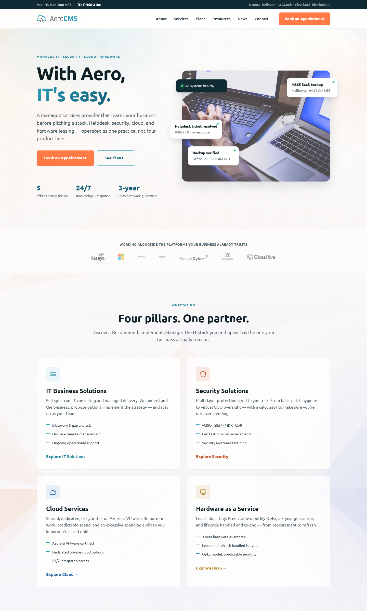

# AeroCMS Redesign Brief

Source materials: current aerocms.net, the XMind strategy map (April 2026 version), Joshua's working context as Sales/Marketing/Onboarding contractor for AeroCMS.

## Who AeroCMS is

- **Legal name:** Aero Computer Management Solutions LLC
- **Type:** MSP (Managed Service Provider) + HaaS (Hardware as a Service)
- **HQ:** Nampa, ID (P.O. Box 1433, 83653)
- **Phone:** (541) 605-2186
- **Offices:** Nampa ID, Bellevue WA, La Grande OR, Cleveland OH, Birmingham AL

## Team (from XMind, not on current site)

| Name | Role |
|---|---|
| Shelby Spencer | CEO, Co-Founder |
| Zach Johnson | CTO / COO, Co-Founder |
| Patrick Mullen | Operations Manager + HR |
| Gary | Senior IT Manager |
| Joshua Keyes | Sales (contracted) |

## Brand voice

- **Tagline:** "With Aero, IT's easy!" — already in use, keep it
- **Positioning:** Custom-tailored IT solutions, not boxed offerings. Consultative MSP. Trust-based selling.
- **Logo:** Teal wordmark "AeroCMS" with a cloud + A-frame mark. Worth preserving — it's clean.
- **Brand color:** Teal/cyan ~#2C9DB7

## What's on the current site (aerocms.net)

- Pages: Home, About, Services (4 sub-pages: IT Business, Security, Cloud, HaaS), Resources, News, Contact
- Stack: WordPress + Divi theme
- Hero: "Custom IT Solutions" over generic blue-tinted server-rack stock photo
- 4 service pillars with deep copy on each
- Contact form (Name, Email, Message)
- 40+ vendor logos on About page
- Single testimonial on Home page

## What the XMind reveals that the site hides

| Asset | XMind has it | Site shows it |
|---|---|---|
| **Tiered plans (Good / Better / Best / Enterprise)** | Yes — fully spec'd | **No** |
| **Partner stack (Kaseya, Benchmark 365, Chartec, GlassHive, Rocket Cyber, VMware, Azure)** | Yes — central to offering | Logo wall only |
| **Tier-1 client trophies (WWOM oilfield, IEC Infred)** | Yes | No |
| **Specific industry verticals** | Yes — oilfield, infrared/thermal, robotics | No |
| **vCISO / SIEM / MDR / EDR as named security services** | Yes | Yes (security page) |
| **HaaS lease-vs-buy financial framing (OpEx vs CapEx)** | Yes | Brief mention |
| **People (team faces, real names)** | Yes | No |

## Redesign goals (in priority order)

1. **Make the offer legible.** Surface the Good / Better / Best / Enterprise tiers on the homepage. This is the single highest-ROI change.
2. **Move trust signals up.** Partner stack + client trophies + real team faces deserve front-page real estate, not buried.
3. **Replace the cold stock photo.** The current server-rack hero says "anonymous data center." The brand says "your IT partner." Visuals should match the consultative voice.
4. **Sharpen the CTA path.** "Book An Appointment" is fine; the path to it should be one click from anywhere.
5. **Modernize visual baseline.** Less Divi-template feel, more contemporary B2B SaaS hygiene (whitespace, big type, clear hierarchy).
6. **Keep what works.** Logo, tagline, teal color, multi-office presence, 4 service pillars.

## Out of scope for this round

- Backend / CMS migration (still WordPress for now if needed; this mockup is presentation-tier only)
- Pricing numbers (XMind has structure, not dollar figures — leave to AeroCMS to fill)
- Subpage redesigns (homepage first; subpages follow once direction is approved)
- Logo redraw (the existing mark is a keeper)

## Deliverable

Static HTML/CSS homepage mockup. View at `file:///c:/development/_queue/aerocms-redesign/index.html`.

Rendered preview: `assets/images/homepage-mockup.png` (1440×2400, headless Chrome, 2026-05-27).

